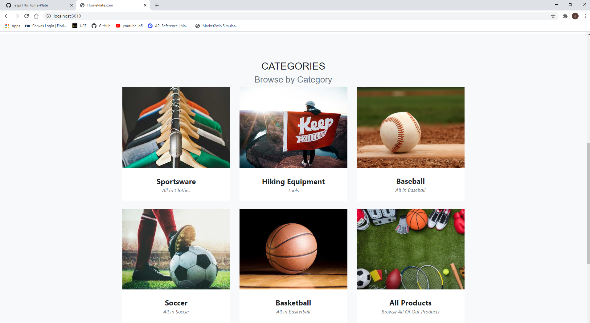

# Home Plate

## License

  

## Description 

In these hard times where we must be socially distant in our communities it is more important than ever to make shopping for goods and needs more accessible to everyone. Many people have been stuck at home for weeks or even months but that should not keep them from obtaining the things they need.

This was the inspiration behind HomePlate.com, an atheletics goodse-commerce website where people who are trying to stay active, while also staying safe and following social distancing guidelines, can get the equipment they need shipped directly to their homes with no direct contact!

Users can create a profile, add products to their cart, edit the quantity of each item or reove them from the cart, and checkout! (This is merely a demo website and not meant for the purposes of actual monetary exchanges, the checkout feature will be non-functional.)
  

## URLs

* Deployed Application: 
    - [https://homeplate-12345.herokuapp.com/](https://homeplate-12345.herokuapp.com/)

* GitHub Repository:
    - [HTTPS: https://github.com/jespi116/Home-Plate.git](https://github.com/jespi116/Home-Plate.git)    
    - [GIT: git@github.com:jespi116/Home-Plate.git](git@github.com:jespi116/Home-Plate.git)

 

## Technologies Used 

* *Bootstrap Framework*
* *JQuery*
* *Fonts for Google API*
* *HTML5*
* *Javascript*
* *CSS*
* *SQL*
* *MYSQL & Sequelize ORM*
* *Express.js*
  

## Developer Team 

* Rogers Ramirez [rogers0404](http://github.com/rogers0404)
* Javier Espinosa [jespi116](http://github.com/jespi116)

 

### Previews:

